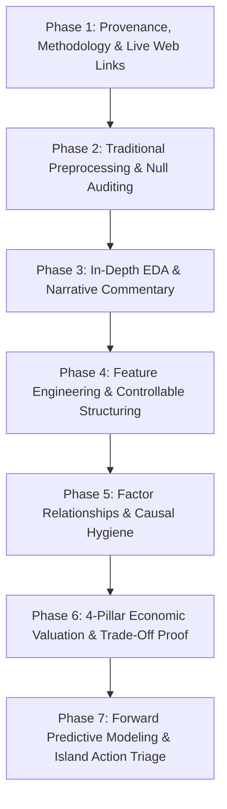

# Design Specification: ReefSafe End-to-End System Architecture

**Topic:** Complete Pipeline, Provenance, Comprehensive Jupyter Notebook, Economic Valuation, and 3-Tab Decision Dashboard  
**Date:** 2026-09-14  
**Project:** ReefSafe — DOSM Datathon 2026 (Chee613/dosm2026)  
**Status:** PROPOSED (Pending User Review)

---

## 1. Executive Summary & Problem Statement

### 1.1 Problem Statement
Malaysia currently lacks an integrated, evidence-based system to:
1. Identify which coral reefs require urgent government management attention.
2. Distinguish local tourism exposure from broader environmental and thermal stress.
3. Determine when and where tourism management interventions (such as temporary access restrictions or mooring controls) are economically and ecologically justified.

### 1.2 Core Value Proposition
**ReefSafe** closes this gap by providing an evidence-bounded screening and decision-support platform. It:
- Prioritizes monitored islands for rapid field verification rather than imposing unfounded bans.
- Separates uncontrollable regional thermal stress (NOAA CRW Degree Heating Weeks) from controllable local human disturbances (anchoring, marine debris, wastewater runoff, built accommodation footprint).
- Quantifies the RM 8.7 Billion/year reef-adjacent economy across 4 pillars, mathematically proving that long-term natural capital preservation outweighs short-term restriction revenue losses.
- Empirically demonstrates the national "Tourism Data Gap" while utilizing audited physical room capacity as a verifiable proxy for human presence.

---

## 2. Data Provenance, Methodology, Assumptions & Source Registry

| Dataset Name | Custodian / Publisher | Official Source Web Link | Methodology / Description | Core Working Assumptions | Limitations & Handling |
|---|---|---|---|---|---|
| **Reef Check Survey Archive (2007–2025)** | Reef Check Malaysia (RCM) | [https://reefcheck.org.my/annualsurveyreports/](https://reefcheck.org.my/annualsurveyreports/) | Standardized 100m underwater transects (4x20m segments) measuring Live Coral Cover (LCC), substrate, fish, invertebrates, and narrative impacts across 56 islands (404 island-years). | Surveyed transects are sufficiently representative of island-wide coral condition across survey intervals. | Irregular survey intervals between years; annualized change is treated as linear between survey points. |
| **NOAA CRW 5km Virtual Stations (1985–2026)** | NOAA Coral Reef Watch (U.S. Dept of Commerce) | [https://coralreefwatch.noaa.gov/product/vs/data.php](https://coralreefwatch.noaa.gov/product/vs/data.php) | Daily satellite SST, SST Anomaly, and Degree Heating Weeks (DHW) extracted from 5 virtual stations matching Malaysian marine ecoregions. | Regional 5km satellite pixel represents thermal stress experienced by nearshore reefs. | Does not capture micro-scale hydrodynamic upwelling or shallow lagoon thermal buffers. |
| **Marine Park Visitors (2000–2017)** | Jabatan Taman Laut Malaysia / MAMPU (data.gov.my) | [https://archive.data.gov.my/data/ms_MY/dataset/jumlah-pelawat-taman-laut-malaysia-dari-tahun-2000-hingga-2009-](https://archive.data.gov.my/data/ms_MY/dataset/jumlah-pelawat-taman-laut-malaysia-dari-tahun-2000-hingga-2009-) | State-level annual domestic and foreign visitor statistics for gazetted Marine Parks (Johor, Kedah, Labuan, Pahang, Terengganu). | Reflects historical government-collected visitor trends at state marine park aggregate level. | **The Tourism Data Gap:** Data ceased after 2017; completely missing Sabah and Sarawak; aggregated at state level rather than island level. Used in EDA to prove the critical data void. |
| **Audited Island Accommodations (2025/2026)** | MOTAC, State Tourism Boards, Municipal Councils | Verified directories (MOTAC, Terengganu Tourism, Sabah Tourism, Tioman Dev Authority) | Ground-truthed inventory of resorts, guest rooms, dive centers, and commercial jetties for all 56 monitored islands. | Total room capacity represents the physical upper-bound ceiling of overnight human presence on an island. | Day-tripper footfall without overnight lodging is uncaptured in room counts; mitigated by logging commercial jetty presence (`has_commercial_jetty`). |
| **State GDP by Economic Activity** | Department of Statistics Malaysia (OpenDOSM) | [https://data.gov.my/data-catalogue/gdp_state_real_supply](https://data.gov.my/data-catalogue/gdp_state_real_supply) | Annual state-level real GDP contributions from Accommodation, Food & Beverage, and Transport services. | Captures macro-economic reliance on tourism at the state scale. | Kept as macro-economic context; never artificially downscaled to individual reefs. |
| **Marine Fisheries Landings** | Department of Fisheries Malaysia / OpenDOSM | [https://data.gov.my/data-catalogue/fish_landings](https://data.gov.my/data-catalogue/fish_landings) | Annual commercial marine fish landings (metric tonnes) by state. | Reflects commercial fisheries output supported by reef nursery habitats. | Confounded by offshore trawling outside reef zones; used as state fisheries indicator. |
| **River Basin Water Quality** | Department of Environment / OpenDOSM | [https://data.gov.my/data-catalogue/water_pollution_basin](https://data.gov.my/data-catalogue/water_pollution_basin) | River basin water pollution indicators (BOD, Ammoniacal Nitrogen, Suspended Solids). | Measures terrestrial runoff entering coastal waters. | River basin stations are mainland-based; island-specific runoff must be cross-referenced with local narrative reports. |

---

## 3. Research Objectives Alignment

### Objective 1: Key Factors Affecting Coral Health
- **Target Sites:** Pulau Tioman, Pulau Redang, Pulau Perhentian, and broader 56-island network.
- **Analysis:** Multivariate panel evaluation of live coral cover change against Sea Surface Temperature Anomaly, NOAA DHW, local water pollution, anchoring impact, and built room capacity.
- **Output:** Correlation matrices, time-series trajectories, and factor relationship graphs.

### Objective 2: Distinguish Environmental Stress from Tourism Pressure
- **Factor Classification:**
  - **Uncontrollable (Regional/Macro Climate):** NOAA Degree Heating Weeks (DHW), regional SST anomalies.
  - **Controllable (Local/Anthropogenic):** Mooring/anchoring damage, marine debris/trash, resort sewage/BOD runoff, and built accommodation footprint.
- **Attribution Methodology:** Dynamic Decomposed Risk Attribution for each island calculating relative percentage contributions (% Uncontrollable Thermal vs. % Controllable Local Stress).

### Objective 3: Prioritise Reef Sites Requiring Government Intervention
- **Triage Matrix:** Priority ranking combining predicted next-period coral decline, current live coral cover baseline, and dominant stressor flags.
- **Targeted Action Protocol:**
  - If $\text{DHW} \ge 4$: *Trigger emergency bleaching survey; do not unfairly penalize tour operators.*
  - If anchor damage reported: *Inspect and deploy fixed mooring buoys; enforce anchoring exclusion zones.*
  - If pollution/waste elevated: *Audit island resort sewage and septic wastewater runoff.*
  - If no dominant stressor: *Deploy field validation teams before considering access restrictions.*

### Objective 4: Balance Reef Protection with Local Economic Needs
- **Valuation Framework:** Official multi-pillar economic valuation benchmarking Malaysia's reef natural capital at **RM 8.7 Billion/year**:
  1. *Marine Tourism & Resorts:* RM 4.8 Billion (55.2%)
  2. *Coastal Protection & Shoreline Erosion Buffer:* RM 2.3 Billion (26.4%)
  3. *Fisheries & Nursery Habitat:* RM 1.1 Billion (12.6%)
  4. *Carbon Sequestration & Biodiversity:* RM 0.5 Billion (5.8%)
- **Trade-off Proof:** 20-year net present value (NPV) simulation showing that temporary seasonal visitor restrictions (sacrificing ~RM 50M–100M in short-term tourist spend) prevent permanent structural reef collapse, preserving billions in long-term natural capital.

---

## 4. Master Jupyter Notebook Architecture (`notebooks/01_reproducible_pipeline.ipynb`)

The notebook will be refactored into an educational, institutional master notebook structured across 7 clear phases:



### Phase Breakdown:
1. **Phase 1: Data Provenance & Source Registry**:
   - Comprehensive provenance table with live Markdown links, custodian details, download links, and extraction notes.
2. **Phase 2: Preprocessing, Schema Inspection & Null Handling**:
   - Step-by-step loading of raw datasets.
   - Transparent missingness audit (documenting why missing values in Reef Check or NOAA are preserved rather than fabricated).
   - In-fold median imputation for modeling pipelines.
3. **Phase 3: Exploratory Data Analysis (EDA) with Critical Commentary**:
   - **Chart 1:** Historical Marine Park Visitor Shortfall (2000–2017) proving the "Tourism Data Gap" (reporting ceased post-2017; no East Malaysia data).
   - **Chart 2:** National Coral Cover Trajectory (2012–2025) showing decline from 57.1% to 39.8%.
   - **Chart 3:** NOAA Thermal Heatwave History highlighting the 2024 record heat spike (DHW > 6.8) and 2025 lagged mortality.
   - Clear markdown commentaries explaining the policy implications of each graph.
4. **Phase 4: Feature Engineering**:
   - Construction of annualized change targets ($LCC\_Change\_Rate$).
   - Integration of audited island accommodations (room capacity, resort counts, dive centers, commercial jetty status).
   - Interaction terms between heat stress and local pollution indicators.
5. **Phase 5: Factor Relationships & Controllable vs. Uncontrollable Analysis**:
   - Empirical relationship plots: DHW vs. Coral Change, Anchoring Mention vs. Change, Trash vs. Change, Pollution vs. Change.
   - Synthesis summary table categorizing factors into Uncontrollable vs. Controllable, reporting sample sizes ($n$), correlation statistics ($\rho$), and $p$-values.
6. **Phase 6: Multi-Pillar Economic Impact & Natural Capital Preservation**:
   - Waterfall/bar visualization of the RM 8.7 Billion reef economy across the 4 pillars.
   - 20-year discounted Net Present Value (NPV) simulation curve demonstrating that short-term revenue sacrifice is dwarfed by long-term reef asset protection.
7. **Phase 7: Forward Predictive Modeling, Feature Importance & Island Triage Queue**:
   - Past-only expanding-window forward evaluation (training on historical years, testing on 5 recent forward years).
   - Benchmark comparison: Gradient Boosting (MAE 5.90 pp/yr) vs. Mean Baseline (MAE 5.99 pp/yr).
   - Tree-based feature importance visualization.
   - Dynamic 56-island priority queue with empirical prediction bands, % contributor breakdown, and actionable next steps.

---

## 5. Interactive Web Dashboard Architecture (3 Aligned Tabs)

### Tab 1: National Live Overview & Reef-Adjacent Economy
- **Top KPI Cards:**
  - National Monitored Coral Cover Baseline (Latest survey mean: 39.8%).
  - Total Reef Economic Valuation (RM 8.7 Billion/year).
  - High-Priority Verification Island Count (Top quartile queue: 10 islands).
  - Active Severe Thermal Alert Count (Islands with DHW $\ge 4$).
- **Interactive Geospatial Map (Leaflet):**
  - Displays all 56 monitored islands color-coded by Screening Priority (High Priority, Monitor, Stable).
  - Popup cards showing current cover, predicted change, room capacity, and dominant stressor.
- **Top 10 High-Risk Island Alert Queue:**
  - Ranked table with immediate inspection triggers (Labuan, Kapas, Lankayan, Seri Buat, Mertang, etc.).
- **Multi-Pillar Economic Impact Breakdown:**
  - Interactive bar/donut chart of the RM 8.7B economy (Tourism RM 4.8B, Coastal Protection RM 2.3B, Fisheries RM 1.1B, Carbon/Biodiversity RM 0.5B).
- **Long-Term Preservation vs. Short-Term Sacrifice Chart:**
  - Interactive NPV trade-off graph comparing 10-year / 20-year economic trajectories under no-action degradation vs. sustainable management.

### Tab 2: Island Prediction & Diagnostics Modal
- **Interactive Island Selector:**
  - Dropdown covering all 56 monitored islands.
- **Predictive Core Card:**
  - Predicted Next Annualized Coral Change (e.g. $-3.63\text{ pp/yr}$) with empirical 90% uncertainty band (e.g. $[-11.45, +4.18]$).
  - Urgency Tier Badge (`High screening priority` vs. `Monitor`).
- **Dynamic Factor Contribution Breakdown (% Shares):**
  - Visual stacked bar / gauge displaying:
    - % Uncontrollable Regional Thermal Stress (DHW).
    - % Controllable Local Human Disturbances (Anchoring, Debris, Wastewater Runoff, Room Density).
- **Targeted Action Protocol Card:**
  - Explicit recommended intervention matching the dominant stressor.
- **Physical Built Capacity & Infrastructure Card:**
  - Verified resort count, estimated guest room inventory, dive center count, commercial jetty status, and data source annotation.

### Tab 3: Scientific Diagnostics & Factor Trends
- **Historical Stressor Trends:**
  - Time-series tracking regional thermal anomalies, bleaching mentions, and coral cover trajectory (2012–2025).
- **Three Core Relationship Graphs:**
  1. *The Tourism Data Gap:* Historical visitor data cessation (2000–2017) highlighting missing years and states.
  2. *Stressors vs. Coral Health:* Empirical scatter plots and boxplots of DHW, anchor damage, and pollution against coral loss.
  3. *Coral Health vs. Economic Output:* Correlation between reef ecosystem integrity, dive tourism viability, and fisheries biomass.
- **Machine Learning Evaluation & Benchmarking:**
  - Out-of-fold validation metrics table and error distribution (Gradient Boosting vs. Baseline MAE, RMSE, $R^2$).

---

## 6. Verification & Testing Plan

### Automated Pipeline Verification
1. Run infrastructure data unit tests:
   ```powershell
   python -m unittest tests.test_infrastructure_data
   ```
2. Run factor diagnostics and statistical integrity tests:
   ```powershell
   python -m unittest tests.test_factor_diagnostics
   ```
3. Run full regression test suite:
   ```powershell
   python -m unittest discover tests
   ```
4. Verify notebook execution:
   ```powershell
   python -m unittest tests.test_notebook
   ```

### Web Dashboard & Visual Verification
1. Launch local dashboard server:
   ```powershell
   python dashboard_server.py
   ```
2. Verify in browser:
   - Tab 1: Leaflet map pins, Top 10 High-Risk table, Economic RM 8.7B breakdown chart, Long-term NPV curve.
   - Tab 2: Island dropdown updates prediction, % controllable/uncontrollable shares, action trigger, and built infrastructure metrics.
   - Tab 3: Tourism data gap graph, factor relationship graphs, and model performance metrics render crisply without console errors.
